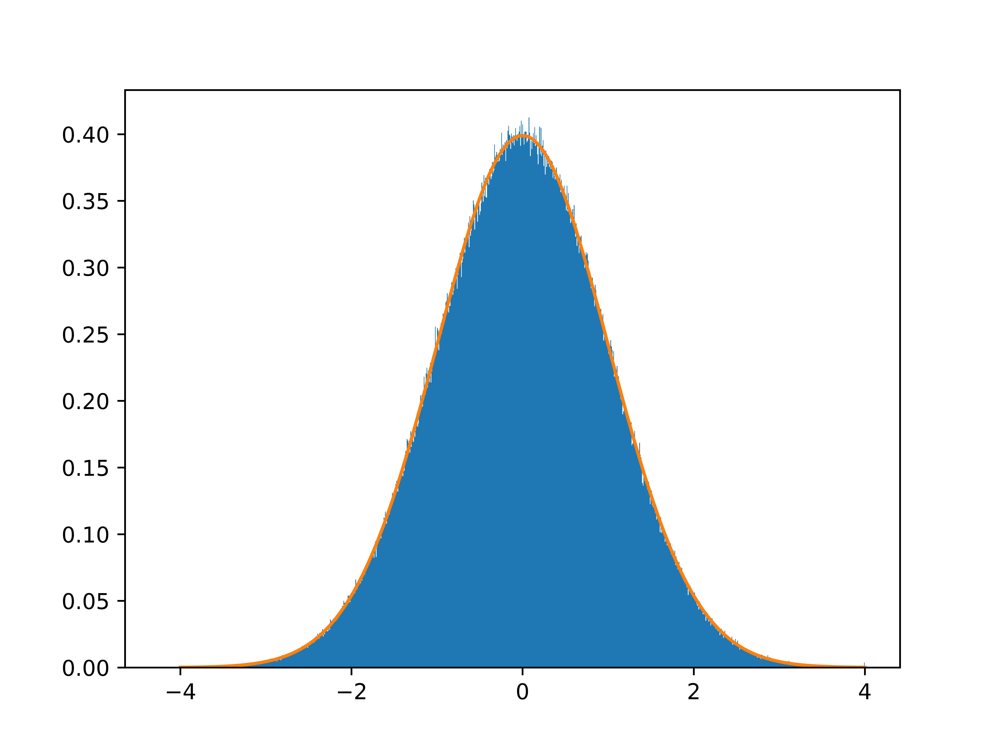

# Inverse Transform Sampling in Rust

## Overview
This library provides tools for simulating random variables based on a given [distribution function](https://en.wikipedia.org/wiki/Cumulative_distribution_function) or [density function](https://en.wikipedia.org/wiki/Probability_density_function).
This will be achieved by using [inverse transform sampling](https://en.wikipedia.org/wiki/Inverse_transform_sampling).

## Current Status
A first working prototype produced

  

You can see in blue the result of pulling 1000000 standard normal distributed values.
In orange you can see the density function of a standard normal distribution.
As you can see they are the same.

## Goals

- [X] Linear interpolation between values
- [X] Inverse Transform Sampling for distribution functions
- [ ] Numeric integration to get distribution function from density function
- [ ] Prebuilt common distributions

## TODOs
- [X] LinearInterpolation class
- [X] Interpolate between values
- [ ] Integrate over values
- [ ] Normalize distribution

- [X] DistributionFunction class

- [X] Inverse Transform Sampling algorithm
- [X] Multiple output values

- [ ] DensityFunction class
- [ ] Conversion to DistributionFunction